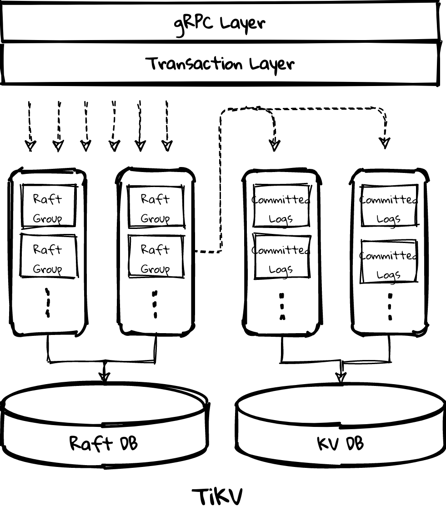
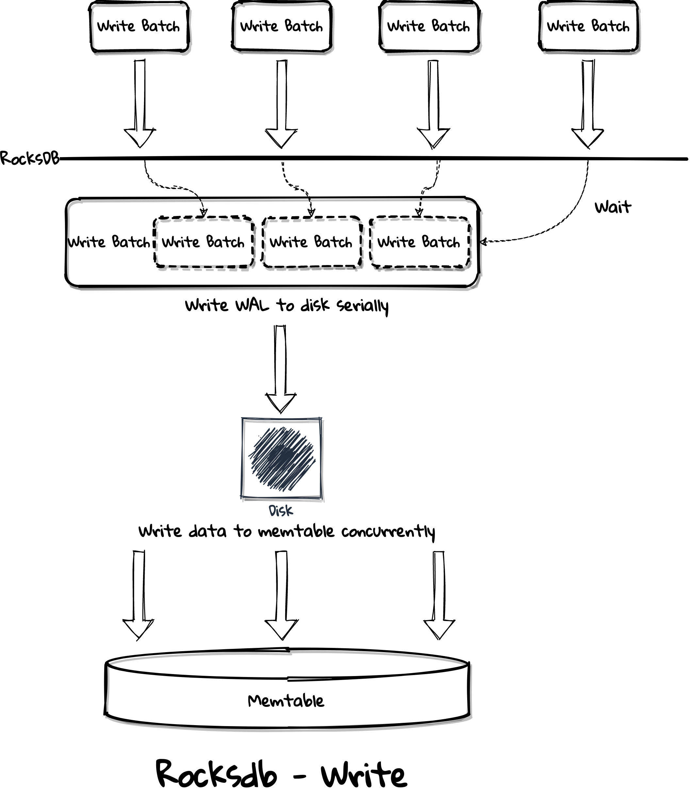

# TPC TiKV

## 团队介绍

- [youjiali1995](https://github.com/youjiali1995): TiDB 分布式事务研发工程师
- [sticnarf](https://github.com/sticnarf): TiDB 分布式事务研发工程师 

## 项目介绍

Better TiKV!!!

##  动机

TiDB 的写入性能和性能稳定性一直被人吐槽，主要原因在 TiKV。作为经常参与性能调优的人，常因为 TiKV 不好的 CPU、disk 资源使用情况感到痛心疾首，以致于不推荐用户给 TiKV 使用 16C 以上的机器，它“不配”。举几个例子：

- 某用户将 16C TiKV 替换成 2 个 8C TiKV，相同并发下性能大幅提升。
- 某用户将 TiKV 机型配置翻倍，即使增加并发吞吐也无任何提升。
- 上述场景，CPU、disk 均未到达瓶颈，且有很多余量。

除了好的机器利用不好外，资源紧张时 TiKV 的表现也不尽如人意：

- 4C/8C/16C 配置下的性能稳定性差距很大。
- 读、写、写的每个 pipeline stage、compaction、backup/restore 等任务互相争抢资源，导致性能不稳定。

除了资源使用问题外，TiKV 的性能调优也是门“技术活”，是只属于少部分 TiDB 研发的游戏，但即使是这些人，性能调优也充满不确定性。TiKV 也不够灵活，无法自动根据压力、workload、机器配置等进行适配，需要为每个用户手动调优，费时费力且无法应对变化。

本项目采用 bottom-up 的设计思路，从更好地利用 CPU、disk 等资源的角度出发，使用 TPC(thread-per-core) 的线程模型来优化 TiKV 的写入性能、性能稳定性和自适应能力。

## 详细设计

TiKV 目前使用经典的 [SEDA](https://en.wikipedia.org/wiki/Staged_event-driven_architecture) 线程模型，它的缺点在 FAQ 里会提到，这里只介绍写入路径上最关键组件的问题 —— raft store。raft store 包含两个 thread pool：store pool 用于处理 raft message、append log 等，raft log 会写入 raft db；apply pool 用于处理 committed log，数据会写入 kv db，目前 raft db 和 kv db 均使用 [rocksdb](https://github.com/tikv/rocksdb)，之后 raft db 会切换到 [raft engine](https://github.com/tikv/raft-engine)。

rocksdb 无法很好的利用现代高速硬盘，因为它的 foreground write(WAL) 只能提供 1 个 I/O depth 且 write group 间同步、排队的消耗很大，而 NMVe SSD 等高速硬盘需要高的 I/O depth 来打满 IOPS，或者大的 I/O size 加上不那么高的 I/O depth 来打满 bandwidth，但大的 I/O size 不适合 OLTP 系统，因为攒大 batch 通常意味着高的延迟。

为了优化 TiKV 的 disk 使用，raft engine 需要支持并发写 WAL 或者拆分 raft db 来并行写多个 WAL 文件，为了更公平的和 upstream TiKV 做性能对比，本次 hackathon 不会对数据模型做很大改动，会实现并行写 WAL，不会拆分 raft db。为了最大化 disk 的压力、更好的 CPU 使用率、更好的性能稳定性，选择使用 async I/O 来实现该功能。

store pool 实现了上述功能后，它的性能应该会大幅优于 apply pool，但可能会消耗更多的资源从而影响整体的性能，如消耗了更多的 CPU 和 disk I/O 资源导致 apply pool 变慢、积攒太多 committed logs 导致 OOM 等，且整个 pipeline 的性能受限于最慢的一个阶段，需要根据最慢的阶段做 back pressure，如调整 store pool 和 apply pool 的线程数量从而保证速度匹配。但拆分多个线程池实在是不易用、不灵活，为了避免手动调优，我们会将 store pool 和 apply pool 合并为单个线程池，为了实现这一目标，raft engine 使用 async I/O 也是必须的，kv db 同样需要使用 async I/O，但 kv db 理论上可以不写 WAL，因为数据可通过 raft log 回放且该功能已有方案，在 hackathon 上会强行去掉 kv db 的 WAL。除了 async I/O 外，还需要实现 CPU scheduler 来保证当 CPU 成为**瓶颈**时单个线程内不同任务成比例地使用资源，如原来 store pool 和 apply pool 的任务各使用 50% 的 CPU 资源。

有了 CPU scheduler 后可以把更多的线程池合并在一起从而实现真正的 unified thread pool，如 gRPC thread pool、scheduler worker pool、unified read pool、rocksdb background threads、backup thread pool 等，CPU scheduler 会给每个原先 thread pool 的任务分配一定比例的资源，且可动态调整，从而提升资源紧张时的性能稳定性、实现自适应和避免手动调参。

### raft engine parallel WAL

### async I/O + store pool

### CPU scheduler

### unified raft store

### unified thread pool

## 缺点

- 追求极致的性能需要数据也按线程划分，但单线程热点不好解决，可以退一步到不划分数据，只是线程为 SMP 模型。 

- 工程难度太高，所有组件都要自己实现。
- `io_uring` 对 kernel 版本有要求，但 linux AIO 能达到相同的效果。

## FAQ

### 不改线程模型能缓解上面的问题么？

可以，但不最优，见 [seastar introduction P8-13](https://docs.google.com/presentation/d/1akbSXhToFicZe_h8hKLfXKerZzUfLpYEWawg96_FI7M/edit?n=seastar#slide=id.g106bde28062_0_55)。

### 为什么要使用 async I/O，raftdb 支持同步、并发写 WAL 不够么？

可以，但不最优，见 [seastar introduction P6-7,29](https://docs.google.com/presentation/d/1akbSXhToFicZe_h8hKLfXKerZzUfLpYEWawg96_FI7M/edit?n=seastar#slide=id.g106bde28062_0_43)。

## Task

